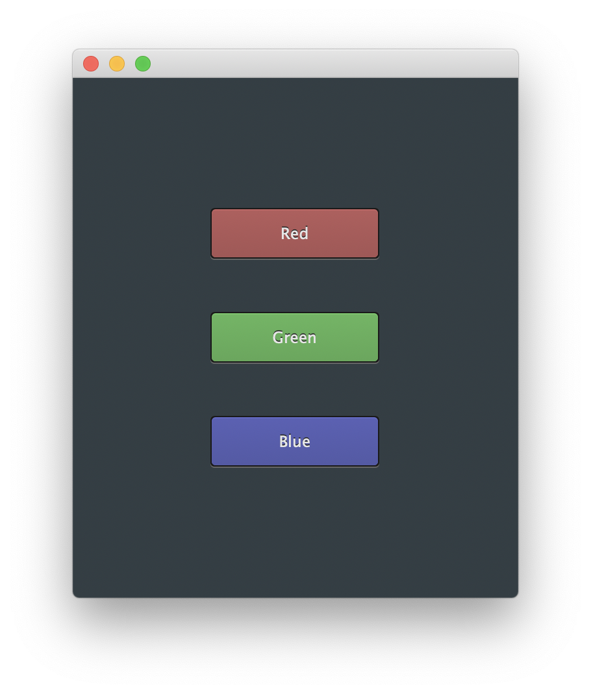
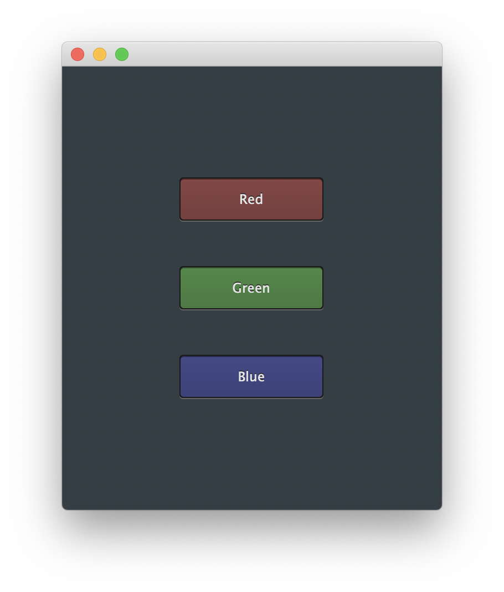

# Juce Cool Button Class

## Screenshots

* Normal state.



* Pushed state.



# How to build the sample applicaiton.

```sh
cd /path/to/juce-cool-button
git submodule update --init --recursive
mkdir build
cd build
cmake -GXcode ..
open JuceCoolButton.xcodeproj
```

# LICENSE

This project is licensed under the MIT license.

